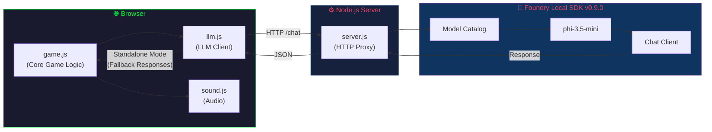

# Space Invaders - AI Commander Edition

## Project Overview

This is a browser-based Space Invaders game with Microsoft Foundry Local SDK integration for AI-powered gameplay features. The game uses a Node.js proxy server to bridge browser-based game code with the local AI model.

## Architecture



## File Structure

| File | Purpose |
|------|---------|
| `server.js` | Node.js proxy server - bridges browser to Foundry Local SDK |
| `llm.js` | Browser-side LLM client - handles API calls and fallbacks |
| `game.js` | Core game logic - imports llm.js for AI features |
| `sound.js` | Web Audio API sound effects system |
| `index.html` | Main game page |
| `styles.css` | Retro arcade styling with CRT effects |

## Coding Patterns

### Foundry Local SDK Integration (v0.9.0+)

When working with the Foundry Local SDK, always use the new API patterns:

```javascript
// ✅ Correct: New SDK v0.9.0 patterns
import { FoundryLocalManager, ChatClientSettings } from 'foundry-local-sdk';

const manager = FoundryLocalManager.create({
    appName: 'my-app-name',
    logLevel: 'info'
});

const catalog = manager.catalog;
const model = await catalog.getModel('phi-3.5-mini');  // Note: async!

// Check if model needs downloading (isCached is a getter property)
if (!model.isCached) {
    await model.download();
}

await model.load();
const chatClient = model.createChatClient();

// Use ChatClientSettings for chat options
const settings = new ChatClientSettings();
settings.maxTokens = 100;
settings.temperature = 0.8;

const response = await chatClient.completeChat([
    { role: 'system', content: 'You are a helpful assistant.' },
    { role: 'user', content: 'Hello!' }
], settings);

// ❌ Deprecated: Old SDK patterns (pre-0.9.0)
// const manager = new FoundryLocalManager();
// await manager.startService();
// await manager.downloadModel(alias);
// const modelInfo = await manager.loadModel(alias);
// Use OpenAI client with manager.endpoint
```

### Graceful Degradation

The game must work in two modes:

1. **Standalone Mode**: Game works by opening `index.html` directly
   - Uses fallback responses from `FALLBACK_RESPONSES` object
   - No server or AI required
   
2. **AI Mode**: Full AI features when server is running
   - Run `npm start` to enable AI Commander
   - Dynamic taunts, briefings, and commentary

```javascript
// Always provide fallbacks for LLM operations
async function generateTaunt(gameState) {
    if (!this.isAvailable) {
        return this.getRandomFallback('taunts');
    }
    // ... AI generation logic
}
```

### ES Modules

This project uses ES modules exclusively:

```javascript
// ✅ Correct
import { something } from './module.js';
export { myFunction };

// ❌ Wrong
const something = require('./module');
module.exports = { myFunction };
```

### Prompt Cache

Use the `PromptCache` class to avoid repeated identical API calls:

```javascript
// Check cache before making LLM calls
const cached = this.cache.get('taunt', context);
if (cached) return cached;

// Store successful responses
const response = await this.sendPrompt(systemPrompt, userPrompt);
if (response) {
    this.cache.set('taunt', context, response);
}
```

### Game Configuration

All game constants are defined in `CONFIG` objects at the top of each file:

```javascript
const CONFIG = {
    player: {
        width: 50,
        height: 30,
        speed: 7,
        lives: 5
    },
    // ... other settings
};
```

### Error Handling

Always use try-catch with informative error messages:

```javascript
try {
    await model.load();
} catch (error) {
    console.error('[Server] Failed to load model:', error.message);
    console.error('[Server] Troubleshooting tips:');
    console.error('         - Check disk space');
    console.error('         - Try different model alias');
    return false;
}
```

## LLM Prompts

When creating prompts for the game AI:

1. **Keep responses short** - `maxTokens: 50-100` for game context
2. **Use high temperature** - `0.7-0.9` for creative variety
3. **Specify word limits** - "Keep it under 15 words"
4. **Match game tone** - Retro sci-fi, appropriate for all ages

```javascript
const systemPrompt = `You are an alien commander in a Space Invaders game. 
Generate a short, menacing taunt for the human player. 
Keep it under 15 words. Be creative but appropriate for all ages.`;
```

## Testing

### Local Testing
```bash
# Install dependencies
npm install

# Start server
npm start

# Open http://localhost:3001 in browser
```

### Standalone Testing
Simply open `index.html` in a browser - the game works without the server.

## Dependencies

| Package | Version | Purpose |
|---------|---------|---------|
| `foundry-local-sdk` | ^0.9.0 | Local AI model inference |

**Note**: No `openai` package required in v0.9.0 - the SDK provides its own chat client.

## Browser APIs Used

- **Canvas API** - Game rendering
- **Web Audio API** - Sound effects synthesis
- **localStorage** - High score persistence
- **Fetch API** - LLM proxy communication

## Model Selection

The default model is `phi-3.5-mini`. To use a different model:

1. Update `CONFIG.modelAlias` in `server.js`
2. Ensure the model exists in the Foundry Local catalog

```javascript
const CONFIG = {
    modelAlias: 'phi-3.5-mini',  // Change this
    // ...
};
```

## Streaming Support

The SDK supports streaming for longer responses:

```javascript
const settings = new ChatClientSettings();
settings.maxTokens = 200;

const stream = await chatClient.completeChatStreaming(messages, settings);
for await (const chunk of stream) {
    if (chunk.choices[0]?.delta?.content) {
        yield chunk.choices[0].delta.content;
    }
}
```

## Performance Considerations

- Cache frequently used prompts (5 minute TTL by default)
- Keep `maxTokens` low for game responsiveness
- Use fallbacks to prevent game freezes on AI failures
- Timeout all fetch requests (10 seconds default)
