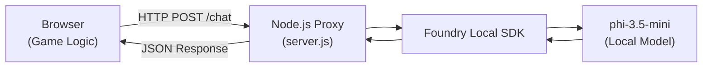

# Building Interactive AI Applications with Microsoft Foundry Local SDK

*A practical guide for AI Engineers and Developers*

## Introduction

As AI engineers and developers, we are constantly seeking ways to integrate large language models into our applications whilst maintaining user privacy and reducing latency. Microsoft Foundry Local provides a compelling solution by enabling local inference of small language models (SLMs) directly on user hardware.

In this post, we will explore how to integrate the Foundry Local SDK v0.9.0 into a browser-based application, using a Space Invaders game as our example. This demonstrates practical patterns for building responsive AI-powered features that run entirely on the user's machine.

## Why Local AI Inference?

Before diving into implementation, let us consider the benefits of local inference:

- **Privacy**: User data never leaves the device
- **Latency**: No network round-trips for inference
- **Offline capability**: Applications work without internet connectivity
- **Cost efficiency**: No API usage fees for inference

These benefits make local AI particularly suitable for interactive applications, games, creative tools, and enterprise software where data sovereignty matters.

## Architecture Overview

Our application follows a common pattern for browser-based AI integration:



The browser cannot directly access Node.js modules, so we use a lightweight proxy server to bridge the gap. This pattern is reusable across any web application requiring local AI capabilities.

## Getting Started with Foundry Local SDK v0.9.0

### Installation

```bash
npm install foundry-local-sdk
```

### Initialisation

The SDK v0.9.0 introduces a cleaner API compared to earlier versions. Here is the complete initialisation pattern:

```javascript
import { FoundryLocalManager, ChatClientSettings } from 'foundry-local-sdk';

// Create the manager with your application name
const manager = FoundryLocalManager.create({
    appName: 'my-ai-application',
    logLevel: 'info'
});

// Access the model catalogue
const catalog = manager.catalog;

// Get the model (async operation in v0.9.0)
const model = await catalog.getModel('phi-3.5-mini');

if (!model) {
    throw new Error('Model not found in catalogue');
}

// Download if not cached (with progress tracking)
if (!model.isCached) {
    console.log('Downloading model...');
    await model.download((progress) => {
        console.log(`Download progress: ${progress.toFixed(1)}%`);
    });
}

// Load into memory
await model.load();

// Create the chat client
const chatClient = model.createChatClient();
```

### Key Changes from Earlier Versions

If you are migrating from SDK v0.3.0 or earlier, note these important changes:

| Aspect | Old Pattern (v0.3.0) | New Pattern (v0.9.0) |
|--------|---------------------|---------------------|
| Manager creation | `new FoundryLocalManager()` | `FoundryLocalManager.create({appName})` |
| Model lookup | Synchronous | `await catalog.getModel()` |
| Chat options | Plain object `{maxTokens, temperature}` | `ChatClientSettings` class |
| OpenAI dependency | Required | Not needed |

## Making Chat Requests

The SDK provides both standard and streaming chat completion:

### Standard Completion

```javascript
const settings = new ChatClientSettings();
settings.maxTokens = 100;
settings.temperature = 0.8;

const response = await chatClient.completeChat([
    { role: 'system', content: 'You are a helpful assistant.' },
    { role: 'user', content: 'What is the capital of France?' }
], settings);

console.log(response.choices[0].message.content);
```

### Streaming Completion

For longer responses or real-time feedback:

```javascript
const settings = new ChatClientSettings();
settings.maxTokens = 500;

const stream = await chatClient.completeChatStreaming(messages, settings);

for await (const chunk of stream) {
    if (chunk.choices[0]?.delta?.content) {
        process.stdout.write(chunk.choices[0].delta.content);
    }
}
```

## Best Practices for Interactive Applications

### 1. Implement Graceful Degradation

Your application should function even when AI is unavailable:

```javascript
class AIManager {
    constructor() {
        this.isAvailable = false;
        this.fallbackResponses = {
            greeting: ['Hello!', 'Hi there!', 'Welcome!']
        };
    }

    async getResponse(prompt, type) {
        if (!this.isAvailable) {
            return this.getRandomFallback(type);
        }
        
        try {
            return await this.chatClient.completeChat([
                { role: 'user', content: prompt }
            ], this.settings);
        } catch (error) {
            console.error('AI request failed:', error.message);
            return this.getRandomFallback(type);
        }
    }

    getRandomFallback(type) {
        const responses = this.fallbackResponses[type] || ['...'];
        return responses[Math.floor(Math.random() * responses.length)];
    }
}
```

### 2. Cache Responses

Avoid repeated identical requests with a simple cache:

```javascript
class ResponseCache {
    constructor(maxSize = 50, ttlMs = 300000) {
        this.cache = new Map();
        this.maxSize = maxSize;
        this.ttl = ttlMs;
    }

    get(key) {
        const entry = this.cache.get(key);
        if (!entry) return null;
        
        if (Date.now() - entry.timestamp > this.ttl) {
            this.cache.delete(key);
            return null;
        }
        
        return entry.value;
    }

    set(key, value) {
        if (this.cache.size >= this.maxSize) {
            const oldestKey = this.cache.keys().next().value;
            this.cache.delete(oldestKey);
        }
        
        this.cache.set(key, {
            value,
            timestamp: Date.now()
        });
    }
}
```

### 3. Keep Token Counts Low

For interactive applications, responsiveness is crucial:

```javascript
const settings = new ChatClientSettings();
settings.maxTokens = 50;  // Short responses for games
settings.temperature = 0.8;  // Some creativity
```

### 4. Provide Download Progress Feedback

Model downloads can take several minutes. Always show progress:

```javascript
let initStatus = {
    state: 'idle',
    progress: 0,
    message: ''
};

await model.download((progress) => {
    initStatus.state = 'downloading';
    initStatus.progress = progress;
    initStatus.message = `Downloading model: ${progress.toFixed(1)}%`;
    
    // Update UI or broadcast to clients
    broadcastStatus(initStatus);
});
```

## Browser Integration Pattern

When building browser applications, expose the SDK through a simple HTTP API:

```javascript
// server.js
import http from 'http';
import { FoundryLocalManager, ChatClientSettings } from 'foundry-local-sdk';

const server = http.createServer(async (req, res) => {
    res.setHeader('Access-Control-Allow-Origin', '*');
    res.setHeader('Access-Control-Allow-Headers', 'Content-Type');

    if (req.url === '/chat' && req.method === 'POST') {
        let body = '';
        req.on('data', chunk => body += chunk);
        req.on('end', async () => {
            const { systemPrompt, userPrompt, maxTokens } = JSON.parse(body);
            
            const settings = new ChatClientSettings();
            settings.maxTokens = maxTokens || 100;
            
            const response = await chatClient.completeChat([
                { role: 'system', content: systemPrompt },
                { role: 'user', content: userPrompt }
            ], settings);
            
            res.writeHead(200, { 'Content-Type': 'application/json' });
            res.end(JSON.stringify({
                content: response.choices[0]?.message?.content
            }));
        });
    }
});

server.listen(3001);
```

## Model Selection

The Foundry Local catalogue includes several models optimised for different use cases:

| Model | Parameters | Best For |
|-------|------------|----------|
| phi-3.5-mini | 3.8B | General purpose, fast inference |
| phi-3-mini | 3.8B | Instruction following |
| phi-3-medium | 14B | Complex reasoning (requires more RAM) |

For interactive applications, `phi-3.5-mini` offers an excellent balance of capability and responsiveness.

## Conclusion

Microsoft Foundry Local SDK v0.9.0 provides a robust foundation for building AI-powered applications that respect user privacy and deliver responsive experiences. The patterns demonstrated here are applicable across various domains:

- **Gaming**: Dynamic dialogue, adaptive difficulty, intelligent NPCs
- **Productivity tools**: Smart suggestions, content generation
- **Creative applications**: Writing assistance, brainstorming
- **Enterprise software**: Document analysis, data extraction

The complete source code for this Space Invaders example is available on GitHub, demonstrating these patterns in a fully functional application.

## Resources

- [Foundry Local SDK Documentation](https://github.com/microsoft/foundry-local-sdk)
- [Microsoft Foundry](https://foundry.microsoft.com)
- [Sample Application: Space Invaders AI Commander](https://github.com/leestott/Spaceinvaders-FoundryLocal)

---

*This post was written for AI Engineers and Developers interested in building local-first AI applications. The patterns and code samples are production-ready and can be adapted for your own projects.*
